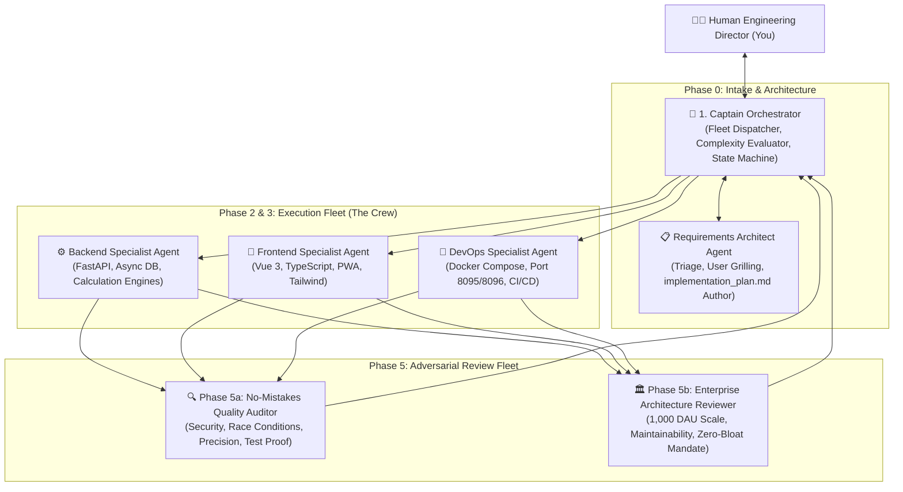
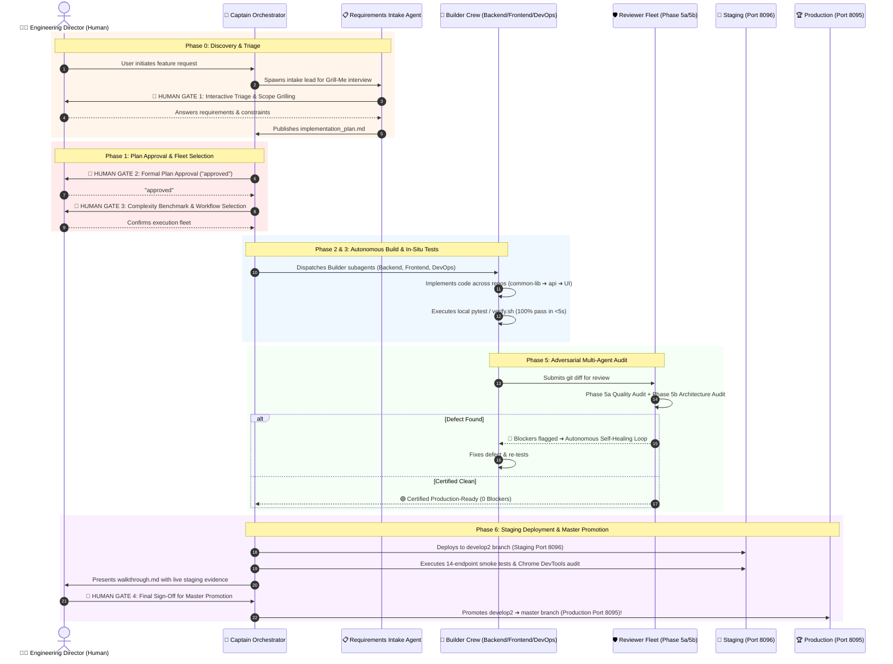

# 🚀 Enterprise Multi-Agent Development Architecture

> **System Standard:** L8 Autonomous Multi-Agent Engineering Fleet  
> **Location:** `.agents/`  
> **Scope:** Architecture guide covering autonomous agent capabilities, memory hierarchy, lifecycle state machines, and human-in-the-loop governance gates.

---

## 🏛️ 1. Multi-Agent Fleet Hierarchy & Topology

Our software engineering system operates as an autonomous, multi-agent fleet led by the **Captain Orchestrator**, backed by specialized builder crews and adversarial reviewer agents:



---

## ⚡ 2. Autonomous Capabilities & Autonomy Level (L8 Standard)

The system operates at **L8 Autonomous Engineering Maturity**:

```
┌────────────────────────────────────────────────────────┬────────────────────────────────────────────────────────┐
│ AUTONOMOUS CAPABILITY                                  │ HOW THE SYSTEM OPERATES                                │
├────────────────────────────────────────────────────────┼────────────────────────────────────────────────────────┤
│ 1. 🔄 Autonomous Self-Healing                          │ When a unit test or reviewer audit fails, the agents   │
│                                                        │ self-diagnose, apply code fixes, and re-test in a loop │
│                                                        │ without needing human intervention.                    │
├────────────────────────────────────────────────────────┼────────────────────────────────────────────────────────┤
│ 2. 🧪 Local In-Situ Test Enforcement                   │ Executes universal `./verify.sh` or `pytest` locally;  │
│                                                        │ 100% of tests must pass in <5s before code review.     │
├────────────────────────────────────────────────────────┼────────────────────────────────────────────────────────┤
│ 3. 🌐 Chrome DevTools MCP Live Browser Automation      │ Uses real Chrome instances to click buttons, inspect   │
│                                                        │ DOM trees, take screenshots, and audit live UI state.  │
├────────────────────────────────────────────────────────┼────────────────────────────────────────────────────────┤
│ 4. 🔗 Cross-Repo Dependency Sequencing                 │ Automatically sequences dependencies across layers:    │
│                                                        │ `common-lib` ➔ `gexdex-api` ➔ `gateway` ➔ `quant-pwa`. │
├────────────────────────────────────────────────────────┼────────────────────────────────────────────────────────┤
│ 5. 🛡️ Adversarial Peer Review                           │ Builder agents cannot merge code directly; independent │
│                                                        │ reviewer agents audit the git diff against strict SRE  │
│                                                        │ and enterprise architecture criteria.                  │
└────────────────────────────────────────────────────────┴────────────────────────────────────────────────────────┘
```

---

## 🧠 3. Memory Structure & Information Flow

The agentic system uses a **4-Tier Hierarchical Memory Architecture** to maintain context across complex tasks without token pollution:

```
┌────────────────────────────────────────────────────────────────────────────────────────┐
│ 1. ⚡ EPHEMERAL CONTEXT MEMORY (Active Working Window)                                  │
│ • Active turn-by-turn context window and reactive subagent message bus.                │
│ • Flushed and summarized automatically when token boundaries approach.                 │
├────────────────────────────────────────────────────────────────────────────────────────┤
│ 2. 📋 PERSISTENT ARTIFACT MEMORY (`brain/<conversation-id>/`)                          │
│ • `implementation_plan.md`: Immutable design specification and technical contract.     │
│ • `walkthrough.md`: Summary of completed work, verification evidence, and screenshots. │
│ • Scratch scripts, local execution logs, and complete JSONL session transcripts.       │
├────────────────────────────────────────────────────────────────────────────────────────┤
│ 3. 📚 LONG-TERM LIVING DOCUMENTATION MEMORY (`docs/` & `.agents/rules/`)               │
│ • Permanent institutional memory: `ARCHITECTURE_OVERVIEW.md`, `APIS_AND_GATEWAYS.md`.  │
│ • Hard governance protocols: `feature-development-protocol.md`.                        │
│ • Automatically updated upon every feature promotion to prevent architecture rot.     │
├────────────────────────────────────────────────────────────────────────────────────────┤
│ 4. 📁 CODEBASE REPOSITORY MEMORY (Git Version Control)                                 │
│ • Source code files, commit histories, git worktrees, and branch snapshots.            │
└────────────────────────────────────────────────────────────────────────────────────────┘
```

---

## 🔄 4. The End-to-End Development Lifecycle (With Human Gates)



---

## 🚦 5. The 4 Mandatory Human-in-the-Loop Governance Gates

The autonomous system never operates as an unchecked black box. Execution is strictly governed by **4 Human Approval Gates**:

```
┌────────────────────────────────────────────────────────┬────────────────────────────────────────────────────────┐
│ HUMAN GATE                                             │ WHAT HAPPENS AT THIS GATE                              │
├────────────────────────────────────────────────────────┼────────────────────────────────────────────────────────┤
│ 🛑 GATE 1: Phase 0 Intake Triage & Grilling            │ You clarify the requirements, business goal, and scope │
│                                                        │ before any code planning begins.                       │
├────────────────────────────────────────────────────────┼────────────────────────────────────────────────────────┤
│ 🛑 GATE 2: Phase 1 Implementation Plan Approval        │ HARD STOP: Zero code changes allowed until you review  │
│                                                        │ and explicitly type "approved" on the plan document.   │
├────────────────────────────────────────────────────────┼────────────────────────────────────────────────────────┤
│ 🛑 GATE 3: Complexity Benchmark & Fleet Selection      │ Captain presents estimated diff size, blast radius,    │
│                                                        │ and recommended agent fleet for your confirmation.     │
├────────────────────────────────────────────────────────┼────────────────────────────────────────────────────────┤
│ 🛑 GATE 4: Staging Validation & Master Promotion       │ HARD STOP: Changes run live on Staging (Port 8096).   │
│                                                        │ Production promotion to Master (Port 8095) strictly    │
│                                                        │ requires your final human sign-off.                    │
└────────────────────────────────────────────────────────┴────────────────────────────────────────────────────────┘
```

---

## 🛡️ 6. Core System Invariants (The Non-Negotiables)

1. **Zero Unreviewed Merges:** Code can never be pushed to `master` directly. All changes must pass Staging Port `8096` first.
2. **Deterministic Test Proof:** Every feature must be backed by automated unit/integration tests with `exit code 0`.
3. **Zero-Bloat Mandate:** Strict YAGNI compliance; no premature abstractions, unused dependencies, or unneeded servers.
4. **Living Documentation Sync:** Whenever a feature is promoted, corresponding documentation in `docs/` is automatically updated.
