# 🛡️ Bug Triage & Remediation Protocol (L8 Standard)

## 0. Mandatory Intake Triage & Grill-Me Gate
Whenever the user points out a defect, issue, or unintended behavior in the code or website:
1. **Explicit Bug Confirmation:** The agent must explicitly confirm the issue and ask what the exact **expected vs. actual behavior** is using a targeted **Grill-Me interview**.
2. **In-Situ Reproduction First:** The agent must execute the **In-Situ Reproduction Gate (RED)** in the active environment before writing any fix.
3. **Plan for Review:** Produce an `implementation_plan.md` detailing the root cause, reproduction evidence, and surgical diff for user approval.

---

## 1. Triage by Blast Radius (Fix Hierarchy)
Never attempt to resolve all findings in a single unstructured pass. Triage and sequence fixes according to this severity hierarchy:

1. **Tier 1: 🔴 Critical Blockers (Immediate Priority)**
   - Silent data loss (e.g. scraper cutoff drops).
   - Database race conditions & table locking (e.g. static temp table collisions).
   - Destructive test side effects (e.g. tests mutating production DB tables).
   - Plaintext credentials or session leaks in source code.

2. **Tier 2: 🟠 High-Impact Correctness**
   - Mathematical / Greek calculation bugs (e.g. DTE operator precedence).
   - Socket & connection leaks (e.g. missing `finally: ib.disconnect()`).
   - Regex boundaries & format truncation (e.g. 4-digit constraints).
   - Unauthenticated API routes or timing attacks.

3. **Tier 3: 🟡 Reliability & UI Glitches**
   - DOM ID mismatches and chart lightbox failures.
   - Message length overflow (e.g. Discord 2000-character limits).
   - Missing repository stubs and incomplete pipeline skeletons.

4. **Tier 4: 🟢 Polish & Accessibility**
   - ARIA labels, comment hygiene, and typing aesthetics.

---

## 2. The 5-Step In-Situ Remediation & Symmetric Verification Protocol

```mermaid
sequenceDiagram
    autonumber
    actor Captain as 🧭 QuantFleetCommander
    participant Subagent as 🛠️ Domain Subagent (e.g. BackendSystemsEngineer)
    participant Env as 🧪 Target Environment (Local / Staging)
    participant Suite as ⚡ Shared Testing Block (pytest)
    participant Auditor as 🛡️ AdversarialQualityAuditor

    Captain->>Subagent: Dispatch Bug Task: 1-3 closely related bugs
    
    rect rgb(40, 20, 20)
    Note over Subagent,Env: STEP 1 & 2: IN-SITU REPRODUCTION (RED GATE)
    Subagent->>Env: Write & Execute tests/test_reproduce_<issue>.py
    Env-->>Subagent: ❌ FAILED (Capture reproduction trace & error log)
    end

    rect rgb(20, 30, 40)
    Note over Subagent: STEP 3: SURGICAL FIX (SMALLEST VIABLE DIFF)
    Subagent->>Subagent: Implement minimal surgical patch (Strict YAGNI)
    end

    rect rgb(20, 40, 20)
    Note over Subagent,Env: STEP 4: SYMMETRIC IN-SITU VERIFICATION (GREEN GATE)
    Subagent->>Env: Re-run EXACT SAME test in EXACT SAME environment
    Env-->>Subagent: ✅ PASSED (100% resolution verified)
    end

    rect rgb(30, 30, 30)
    Note over Subagent,Auditor: STEP 5: SHARED TESTING BLOCK & ADVERSARIAL AUDIT
    Subagent->>Suite: Run full combined suite (./verify.sh / pytest in <5s)
    Suite-->>Subagent: ✅ 100% Pass (Zero collateral regressions)
    Subagent->>Auditor: Submit Git Diff
    Auditor->>Auditor: Check: Diff MUST contain test_reproduce_* + surgical fix
    Auditor-->>Captain: 🟢 APPROVED: Full before/after proof verified
    end
```

### Step 1: Micro-Plan Scope & Backlog Ingestion
- **Zero-Lost Bugs Invariant (MANDATORY):** Any bug, edge case, or defect discovered during development, testing, or review that is NOT immediately patched in the active turn MUST be logged immediately into `implementation_plans/00_ACTIVE_BACKLOG.md` with priority, component, and blast radius.
- Scope each active remediation task to **1 to 3 closely related bugs** within a single subsystem or dependency boundary.

### Step 2: In-Situ Reproduction Gate (MANDATORY RED STATE)
- `QuantFleetCommander` dispatches a **single domain crew subagent** (`BackendSystemsEngineer`, `MobileFrontendEngineer`, or `DataPipelineEngineer`) who owns the bug end-to-end.
- **Hard Invariant:** The subagent is **strictly forbidden from modifying application source code** until it has written an isolated reproduction test in `tests/test_reproduce_<issue>.py` and executed it in the active environment to produce a verified **RED (failing)** result.
- The subagent must capture and log the exact failure message and stack trace.

### Step 3: Smallest Viable Diff (Strict YAGNI)
- The subagent patches ONLY the lines necessary to fix the root cause with zero collateral churn.
- Strictly avoid speculative refactoring, formatting churn, or modifying unrelated files.

### Step 4: Symmetric In-Situ Verification Gate (MANDATORY GREEN STATE)
- **Hard Invariant:** The subagent must re-run the **exact same reproduction test in the exact same execution environment** where the bug was reproduced.
- The reproduction test must now pass with `exit code 0` (**GREEN**).

### Step 5: Shared Testing Block & Adversarial Gate
- **Combined Regression Suite:** The subagent executes the universal `./verify.sh` or `pytest` suite across the entire workspace to mathematically prove zero collateral regressions.
- **Adversarial Audit Gate (`AdversarialQualityAuditor`):** The reviewer audits the git diff. If the diff does not include a dedicated `tests/test_reproduce_*` test file demonstrating before/after proof, the patch is **immediately rejected**.
- **Staging In-Situ Health Gate:** `QuantFleetCommander` deploys the branch to `develop2` staging (`8091`/`8096`) on the Synology NAS for live validation.
- **Master Promotion & Auto-Teardown:** Upon explicit human approval, promote to `master`, automatically tear down ephemeral `develop2` containers, move the item from `00_ACTIVE_BACKLOG.md` to `completed_archive/`, and synchronize living documentation in `docs/`.
