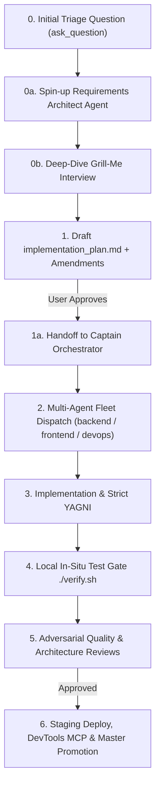

# 🚀 Feature Development Protocol (L8 Standard)

## 0. Mandatory Intake Triage & Requirements Architect Gate

Whenever a user requests new functionality or enhancements, the workflow **MUST START with an interactive triage interview**:

### 1. Mandatory Scoping Triage (via `ask_question`)
The agent must clarify the scope, domain, and blast radius of the requested capability:
1. **User Experience & Interaction Flow**: What does the end user or consumer experience? (UI components, PWA views, mobile responsiveness, visual feedback).
2. **API Contracts & Data Schemas**: What endpoints, request payloads, Pydantic models, and response structures are required?
3. **Quantitative & Business Logic**: What specific algorithms, calculations (GEX/DEX, Greeks, flow filters), or data transformations apply?
4. **Data & Infrastructure Dependencies**: Which pipelines, database tables, caches (Redis/memory), or external APIs are touched?

> [!NOTE]
> **Tier 4 Fast-Track (Cosmetic / Documentation Only):** Pure documentation updates (`docs/`, `*.md`) or isolated CSS cosmetic styling tweaks that do not alter state, logic, or API contracts bypass the multi-agent review fleet and can proceed directly with local verification.

### 2. Dedicated Subagent Spin-Up: `requirements_architect_agent`
A specialized **Requirements & Architecture Intake Agent** (`requirements_architect_agent`) conducts the deep-dive Grill-Me interview:
- Grills the user iteratively on edge cases, failure states, empty states, and backward compatibility until requirements are 100% crystal clear.
- Explicitly establishes performance and latency SLAs (e.g. `< 50ms` cache hits, sub-5-second test execution).

### 3. Implementation Plan Creation & Amendment Loop
- The `requirements_architect_agent` produces or updates the `implementation_plan.md` artifact.
- The agent listens to user feedback and makes any necessary amendments to the plan.

### 4. Handoff to the Captain (Parent Orchestrator)
- Once the user explicitly reviews and approves the implementation plan (`"approved"` / `"proceed"`), the plan is **handed off to the Captain** (`QuantFleetCommander`).
- The Captain presents the Complexity Benchmark & Fleet Recommendation and dispatches the execution fleet.

---

## 1. The 6-Phase Feature Lifecycle

---

## 2. Detailed Phase Specifications

### Phase 1: Architecture RFC & Implementation Plan
- Never write source code from an initial prompt. Always create `implementation_plans/<feature_name>.md` or `implementation_plan.md`.
- **Mandatory Plan Structure:**
  1. **Architecture & Design Decisions:** Explain technical trade-offs, schemas, and API contracts.
  2. **User Review Required:** Highlight any breaking changes or design choices using GitHub alerts.
  3. **Open Questions:** Surface any ambiguities before proceeding.
  4. **Component Breakdown:** Categorize files logically with `[NEW]`, `[MODIFY]`, or `[DELETE]` annotations.
  5. **Verification Plan:** Define automated test commands (`pytest`, `./verify.sh`) and manual validation steps.
- **Mandatory Approval Gate (HARD RULE):** STOP and wait for the human Engineering Director's explicit approval before touching ANY source code files or making any edits. Zero code changes are allowed before prior plan approval.
- **Mandatory Multi-Agent Workflow Selection & Benchmark Gate (HARD RULE):** Whenever the user approves an implementation plan, the agent **MUST provide a brief Complexity Benchmark (estimated diff size, subsystems affected, blast radius risk, and recommended fleet)** and explicitly ask the user which multi-agent workflow to use, waiting for the user's selection before proceeding to Phase 2/3.
- **Mandatory Chrome DevTools UI Verification Gate (HARD RULE):** Whenever the frontend UI (HTML, CSS, JavaScript, views, modals, PWA) is modified or created, the agent **MUST use Chrome DevTools MCP tools** (`navigate_page`, `take_screenshot`, `evaluate_script`, `click`, etc.) to visually and functionally test and verify the live UI in a real browser session across ALL workflows.
- **Mandatory Staging Approval Gate Before Master Promotion (HARD RULE):** NEVER merge or push code to `master` (Production) directly or automatically. All changes MUST be deployed to `develop2` (Staging, port `8096`), verified live, and presented to the user. Promotion to `master` strictly requires the user's explicit approval. Zero exceptions.

### Phase 2: Dependency Sequencing & Worktree Isolation
- Always sequence cross-repo development in correct architectural order:
  1. `common-lib` / `common_config` (Shared models & connectors)
  2. `gexdex-api` / `gateway` (Endpoints & calculations)
  3. `*-pipeline` (ETL scrapers & database loaders)
  4. `quant-pwa` / `discord-quant-bot` (Clients & UI)
- Isolate execution to the active feature branch on `develop2` (or dedicated worktree).

### Phase 3: Implementation & Anti-Bloat (Strict YAGNI)
- **Smallest Viable Diff:** Implement ONLY the capabilities approved in Phase 1.
- **Strict Typing:** All data models must use Pydantic models (Python) or explicit interfaces (JavaScript/TypeScript).
- **Configuration Hygiene:** Read all parameters from `MainConfig` or environment variables; never hardcode credentials, ports, or URLs.
- **Failure Resilience:** Wrap network operations in exponential backoff retries and explicit timeouts.
- **AI Governance Invariants:**
  - **Zero Trade Advice Rule:** Never emit buy/sell recommendations, trade triggers, or price targets in AI text. Provide strictly objective quantitative microstructure breakdowns.
  - **ADHD-Friendly Brevity Rule:** Keep all analysis ultra-succinct, bulleted, bolded, and glanceable in < 10 seconds.

### Phase 4: Shared Testing Block (Local In-Situ Verification Gate)
- Write comprehensive acceptance unit and integration tests in `tests/` covering both happy paths and negative edge cases.
- Execute the universal `./verify.sh` or `pytest` suite in the workspace to confirm:
  - Static typechecks pass with 0 errors.
  - All unit tests pass with `exit code 0` in <5 seconds (zero collateral regressions).
  - Zero database mutations occur against production tables.
- **Chrome DevTools MCP UI Probing:** If frontend changes are included, interactively verify DOM rendering, touch targets, and mobile responsive states.

### Phase 5: Multi-Agent Review Fleet & Mandatory Architect Sign-Off Gate

#### 1. Software & Architecture Design Risk Reviewers
Features are reviewed across 4 Core Engineering Specializations:
1. **⚡ Performance & Concurrency Risk:** Audits async/await usage, connection pool starvation, event loop blocking, memory leaks, and ensures sub-50ms query/API SLA.
2. **🛡️ API Security & Auth Integrity:** Audits session tokens, Bearer auth guards, rate limiting lockout, input sanitization, and ensures zero plaintext credentials.
3. **🧮 Quantitative & Algorithmic Correctness:** Validates mathematical precision, options Greek boundaries, floating point stability, and NaN/Inf sanitization.
4. **📱 UX, Layout & State Resilience:** Audits mobile responsive breakpoints, DOM lifecycle, offline PWA cache states, and error boundary handling.

#### 2. Mandatory Reviewer Presentation Standard (Phase 5a & 5b)
Every reviewer finding MUST follow the **3-Point Standard**:
1. **The Finding:** Clear technical description of the defect, vulnerability, or design flaw.
2. **Reasoning & System Impact:** What goes wrong if ignored (e.g. *"Starves Postgres pool under 20 concurrent queries"*).
3. **Actionable Recommendation:** Concrete code patch or architectural modification to resolve it.

#### 3. Phase 5c: Mandatory Architect Review & Acknowledgment Gate (HARD RULE)
- **Zero Unacknowledged Findings Rule:** Every finding presented by Reviewers MUST be formally reviewed and acknowledged by the Architect (`Lead Architect` / `QuantFleetCommander`).
- The Architect must publish a **Formal Review Disposition Matrix**:
  * `[ACCEPTED & REMEDIATED]`: Architect/crew patches code, re-runs tests, and proves resolution.
  * `[ACCEPTED AS TRADE-OFF]`: Architect provides formal rationale for why it is an acceptable trade-off for current scope.
  * `[REJECTED WITH PROOF]`: Architect provides technical/mathematical proof demonstrating the concern is already satisfied.
- **Zero findings may be silently ignored or bypassed.** Approval is strictly blocked until 100% of findings have a documented disposition.

---

### Phase 6: PR Summary, Staging Validation & Living Documentation
- Produce a clean, concise PR summary document or walkthrough detailing:
  - What was built and why.
  - Verification results and test output.
  - Key decisions made.
- Deploy to staging develop container for human-in-the-loop validation.
- **Mandatory Local Server Teardown:** Whenever local testing completes and changes are pushed to `develop`/`develop2` or `master`, agents MUST automatically terminate all local background testing processes (`uvicorn`, `http.server`, Chrome instances) to release local ports (`3000`, `8000`) and conserve PC memory.
- **Mandatory Living Documentation Sync:** Upon promotion/merging to `master`, automatically update all corresponding design and architecture documents in `docs/` (`ARCHITECTURE_OVERVIEW.md`, `DATABASE_AND_DATA_MODELS.md`, `ETL_PIPELINES_AND_INGESTION.md`, `APIS_AND_GATEWAYS.md`, `FRONTEND_AND_BOT_APPLICATIONS.md`, `INFRASTRUCTURE_AND_CICD.md`). Outdated architecture documentation is treated as a critical system defect.
