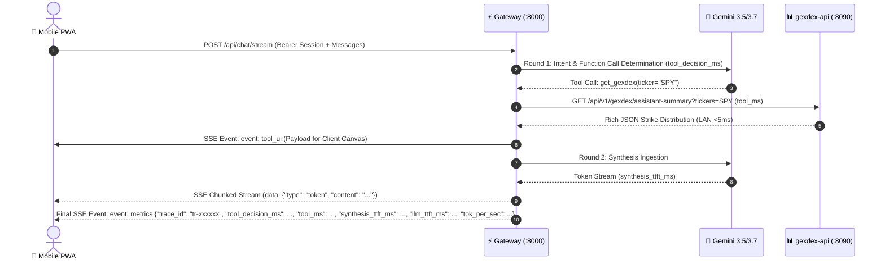

## 1. Overview

The Quant System exposes a unified high-performance API surface via the **`quant-pwa` Modular Monolith** (Port `8095` Prod / `8096` Staging):
1. **In-Process Options Analytics Engine (`GexDexService`):** Native calculation engine with defensive `CircuitBreaker`, SWR pre-caching, and sub-millisecond execution (`0.6ms`).
2. **Backward-Compatible REST Endpoints:** Direct `/api/v1/gexdex/*` routes for third-party bots, mobile apps, and scripts.
3. **Real-Time AI Chat Streaming (`/api/chat/stream`):** SSE streaming with Dynamic Split-Model Router (`gemini-3.5-flash-lite` vs `gemini-3.7-flash`), asymmetric payload splitting, and 5-bar hardware waterfall telemetry.
4. **Model Context Protocol (MCP) Server (`/mcp/sse`):** Pluggable tool hub for Claude Desktop, Gemini SDK, and agent swarms.

---

## 2. Options Analytics REST Endpoints (`/api/v1/gexdex/*`)

### 2.1 Health Check
* **`GET /health`** or **`GET /api/health`**
* **Auth:** None (Public)
* **Response:**
  ```json
  {
    "status": "ok",
    "service": "quant-gateway",
    "market": {
      "status": "REGULAR_MARKET_OPEN",
      "is_live_trading": true,
      "description": "Regular market trading hours (9:30 AM - 4:00 PM EDT)",
      "current_time_ny": "Monday, Aug 24, 2026 - 10:15 AM EDT",
      "iso_timestamp": "2026-08-24T10:15:00.000000-04:00"
    }
  }
  ```

---

### 2.2 Assistant Summary (JSON Quantitative Metrics)
* **`GET /api/v1/gexdex/assistant-summary`**
* **Auth:** `X-API-Key: <SECRET>` (or `api_key` query param)
* **Parameters:**
  - `ticker` (string, required): Ticker symbol (e.g. `SPY`, `NVDA`).
  - `include_chart` (boolean, optional, default: `true`): Include markdown chart URL reference.
* **Response (`200 OK`):**
  ```json
  {
    "ticker": "NVDA",
    "spot_price": 128.50,
    "call_wall": 135.0,
    "put_wall": 120.0,
    "zero_gex_level": 124.80,
    "net_gex": 45820000.0,
    "net_dex": -12450000.0,
    "call_gex": 68200000.0,
    "put_gex": 22380000.0,
    "call_put_ratio": 3.05,
    "gamma_regime": "LONG_GAMMA",
    "pin_risk_level": "MODERATE",
    "front_week_gex_pct": 0.642,
    "snapshot_time": "2026-08-21T20:00:00Z",
    "chart_url": "/api/v1/gexdex/chart.png?ticker=NVDA"
  }
  ```

---

### 2.3 Chart Image Binary Rendering
* **Parameters:**
  - `ticker` (string, required)
* **Response (`200 OK`):** Binary WebP/PNG image stream with `Content-Type: image/png` and `Cache-Control: public, max-age=300`.

---

### 2.4 DTE & Pin Risk Gamma Calculation Engine
* **Timezone Safety:** All option expiration timestamps are localized to UTC (`exp_date.tz_localize(timezone.utc) if exp_date.tzinfo is None else exp_date`) and subtracted from `datetime.now(timezone.utc)`.
* **Front-Week Gamma Concentration:**
  $$\text{Front-Week GEX Concentration} = \frac{\sum_{0 \le \text{DTE} \le 7} |\text{Net GEX}_{\text{exp}}|}{\text{Total Abs GEX}}$$
* **Pin Risk Classification:**
  - `HIGH`: Front-Week GEX Concentration $\ge 0.70$ and $|\text{Spot} - \text{Dominant Strike}| / \text{Spot} \le 0.015$.
  - `MODERATE`: $0.40 \le \text{Front-Week GEX Concentration} < 0.70$.
  - `LOW`: Front-Week GEX Concentration $< 0.40$.

---
  - `ticker` (string, required): Ticker symbol.
  - `format` (string, default: `webp`): Image format (`webp`, `png`).
* **Response:** Binary image stream (`image/webp` or `image/png`).
* **Concurrency Protection:** Protected by server-side `threading.Lock()` and in-memory `TTLCache`.

---

## 3. `quant-pwa` Gateway & Telemetry Streaming Engine



### 3.1 SSE Streaming Events Contract

| Event Name | Frame Structure | Purpose |
| :--- | :--- | :--- |
| **`tool_ui`** | `event: tool_ui\ndata: {"name": "get_gexdex", "payload": {...}}` | Transmits raw numerical strike tables directly to the frontend `<canvas>` renderer. |
| **`token`** | `data: {"type": "token", "content": "..."}` | Streamed text chunks generated by Gemini. |
| **`metrics`** | `event: metrics\ndata: {"trace_id": "...", "tier_used": "fast|strategic", "model_used": "...", "tool_decision_ms": ..., "tool_ms": ..., "synthesis_ttft_ms": ..., "llm_ttft_ms": ..., "token_count": ..., "tok_per_sec": ..., "server_total_ms": ...}` | Performance telemetry payload powering the client-side Diagnostics Waterfall HUD. |
| **`done`** | `data: {"type": "done"}` | Signals end of stream and triggers response badge mounting. |

---

### 3.2 Dynamic Split-Model Router (Router-Worker-Synthesizer Pattern)
* **Tier 1 (Fast Worker - `gemini-3.5-flash-lite`):** Handles high-frequency, single-ticker options lookups with `budget=0` (omits `thinking_config`) for **`< 1.0s` tool decision latency**.
* **Tier 2 (Strategic Synthesizer - `gemini-3.7-flash`):** Activated automatically when query matches macro keywords (`FOMC`, `rates`, `CPI`, `correlation`, `strategy`, `portfolio`) or multi-ticker cohorts. Configures a **512-token Chain-of-Thought thinking budget** for deep cross-asset synthesis.
* **Instant Failover Hierarchy:** 
  - Strategic Tier: `[3.7-flash -> 3.6-flash -> 3.5-flash-lite]`
  - Fast Tier: `[3.5-flash-lite -> 3.6-flash]`
  - Recovers from Google 429/503 spikes in `< 500ms` without blocking thread sleeps.

---

### 3.3 Top 20 Benchmark RAM Pre-Cache Warmer
* **Universe (20 Liquid Equities & Indices):** `SPY`, `QQQ`, `IWM`, `NVDA`, `AAPL`, `TSLA`, `META`, `AMZN`, `GOOGL`, `MSFT`, `AMD`, `PLTR`, `TSM`, `SMCI`, `COIN`, `CRWD`, `NFLX`, `SPX`, `NDX`, `RUT`.
* **Schedule:** Background asyncio loop runs every 180 seconds during US market trading hours (**Mon–Fri 08:30–16:15 ET**).
* **Speed:** Guarantees **`0.0ms` upstream tool latency** (`[CACHE: HIT]`) for >95% of daily user volume.

---

### 3.4 In-Memory Ring Buffer Remote Logging (`GET /api/diagnostics/logs`)
* **Endpoint:** `GET /api/diagnostics/logs?limit=100`
* **Auth:** Bearer Session Token (`verify_app_passcode`).
* **Implementation:** `_RingBufferHandler` captures the last 200 formatted log records in memory, allowing live debugging of Docker containers on DSM directly over HTTP without requiring SSH root permissions.

---

### 3.5 Options Flow Status & Synchronous Cache Invalidation (`/api/flow/*`)

#### 3.5.1 Options Flow Freshness Check (`GET /api/flow/status`)
* **Endpoint:** `GET /api/flow/status`
* **Auth:** Public / Unauthenticated
* **Purpose:** Evaluates latest `MAX(trade_date)` from `unusual_option_flow_te` against the last completed US market session. Returns `status: "synced"` (`is_fresh: true`) or `status: "stale"` (`is_fresh: false`).

#### 3.5.2 Manual Pipeline Trigger & Synchronous Invalidation (`POST /api/flow/sync`)
* **Endpoint:** `POST /api/flow/sync`
* **Auth:** Bearer Session Token (`get_current_user`).
* **Execution:** Triggers `common_lib.flow.runner.run_daily_incremental()` and immediately calls `clear_flow_cache()`.
* **Cache Invalidation:** Atomically purges both `_FLOW_MEMORY_CACHE` and `_LAST_EXECUTED_FLOW_RESULT` under `_FLOW_CACHE_LOCK`, guaranteeing zero stale reads across subsequent LLM streaming chat requests.

---

### 3.6 Ticker Cockpit Endpoints (`/api/cockpit/*`)

#### 3.6.1 Cockpit Unified Data Aggregator (`GET /api/cockpit/data`)
* **Endpoint:** `GET /api/cockpit/data?ticker=<SYMBOL>`
* **Auth:** Bearer Session Token (`Authorization: Bearer <token>`)
* **Parameters:**
  - `ticker` (string, required): US Equity/Index symbol (e.g. `NVDA`, `SPY`, `TSLA`).
* **Execution Latency:** Sub-100ms in-process aggregation.
* **Payload Structure (`200 OK`):**
  ```json
  {
    "ticker": "NVDA",
    "status": "success",
    "gex": {
      "spot_price": 217.55,
      "zero_gex_level": 211.20,
      "call_wall": 220.0,
      "put_wall": 220.0,
      "net_gex": 209912341389.29,
      "net_dex": 25546999485.99,
      "gamma_regime": "Positive (Long Gamma / Volatility Dampening)",
      "strike_distribution": { ... }
    },
    "flow": {
      "records": [ ... ],
      "total_count": 18
    },
    "metrics": {
      "spot_price": 217.55,
      "zero_gamma_flip": 211.20,
      "call_wall": 220.0,
      "put_wall": 220.0,
      "net_gex": 209912341389.29,
      "net_dex": 25546999485.99,
      "gamma_regime": "Positive (Long Gamma / Volatility Dampening)",
      "total_30d_flow_volume": 41088000,
      "call_flow": 30288000,
      "put_flow": 10800000,
      "call_pct": 73.71,
      "put_pct": 26.29,
      "whale_count": 15,
      "unusual_oi_count": 0,
      "confluence_bias": "BULLISH CONFLUENCE"
    }
  }
  ```

#### 3.5.2 Streaming Synergized Tactical Synthesis (`POST /api/cockpit/synthesis/stream`)
* **Endpoint:** `POST /api/cockpit/synthesis/stream`
* **Auth:** Bearer Session Token (`Authorization: Bearer <token>`)
* **Content-Type:** `application/json`
* **Payload:**
  ```json
  {
    "ticker": "NVDA",
    "gex": { ... },
    "flow": { ... },
    "confluence": { ... }
  }
  ```
* **Streaming Protocol:** Server-Sent Events (`text/event-stream`) streaming Markdown tokens directly to client DOM:
  - `data: {"type": "token", "content": "..."}`
### 3.3 Options Flow Status & Manual Ingestion Endpoints (`/api/flow/*`)

#### 1. Flow Freshness Status (`GET /api/flow/status`)
* **Auth:** None (Public / Client Evaluated)
* **Purpose:** Evaluates `MAX(trade_date)` in `unusual_option_flow_te` against the last active trading market day (handles weekends and 6:30 AM trading day cutoffs).
* **Response (`200 OK`):**
  ```json
  {
    "status": "synced",
    "is_fresh": true,
    "latest_trade_date": "2026-08-29",
    "last_market_day": "2026-08-28",
    "total_records": 2345,
    "last_session_records": 0,
    "message": "Flow data is up to date (Session: 2026-08-29)."
  }
  ```

#### 2. Manual Flow Ingestion Sync (`POST /api/flow/sync`)
* **Auth:** `Authorization: Bearer <SESSION_TOKEN>` (Protected)
* **Purpose:** Triggers on-demand incremental options flow ingestion in-process or host runner.
* **Response (`200 OK`):**
  ```json
  {
    "status": "ok",
    "message": "Options Flow sync completed successfully. Ingested 820 records.",
    "rows_upserted": 820
  }
  ```

### 3.4 Quant Levels Status & Ingestion Endpoints (`/api/quant-levels/*`)

#### 1. Quant Levels Freshness Status (`GET /api/quant-levels/status`)
* **Auth:** None (Public)
* **Purpose:** Evaluates `quant_lvl_data_te` against Eastern Time 6:30 AM market cutoff and Friday weekend resolution.
* **Response (`200 OK`):**
  ```json
  {
    "status": "synced",
    "is_fresh": true,
    "latest_record_date": "2026-08-28",
    "expected_date": "2026-08-28",
    "total_records": 2800,
    "expected_day_records": 1,
    "message": "Quant levels are up to date (Session: 2026-08-28)."
  }
  ```

#### 2. Manual Quant Levels Sync (`POST /api/quant-levels/sync`)
* **Auth:** `Authorization: Bearer <SESSION_TOKEN>` (Protected)
* **Purpose:** Triggers `common_lib.quant_levels.runner.run_daily_incremental()` to scrape and load the latest price levels into PostgreSQL.
* **Response (`200 OK`):**
  ```json
  {
    "status": "ok",
    "message": "Quant Levels sync completed successfully. Ingested 10 records.",
    "rows_upserted": 10
  }
  ```

---

## 4. Model Context Protocol (MCP) Server Specifications

The Gateway exposes standard Model Context Protocol (MCP) Universal Dual-Transport endpoints for autonomous agents, supporting both modern Streamable HTTP direct JSON-RPC POST and legacy Server-Sent Events (SSE):

* **Dual-Transport SSE Endpoints:** `GET /mcp/sse`, `GET /sse` (Initiates SSE stream) & `POST /mcp/sse`, `POST /sse` (Direct JSON-RPC)
* **Message & Root Endpoints:** `POST /mcp/messages`, `POST /messages`, `POST /mcp` (Direct JSON-RPC & Session Queues)
* **Service Discovery:** `GET /mcp`, `GET /mcp/messages`, `GET /messages` (Returns server info & protocol version `2024-11-05`)

### Implemented MCP Tools & Agent Tool Registry:
1. **`get_gexdex(ticker: str)`**: Retrieves real-time Call/Put Walls, Net Gamma, Net Delta, Gamma Flip level, and institutional dealer regime. Single-flight comma-separated batching (`META,AAPL,...`) supported.
2. **`get_unusual_flow(date: Optional[str] = None)`**: Queries institutional options flow prints, block trades, and sweeps from PostgreSQL table `unusual_option_flow_te`. Returns 100% of prints formatted as a pure Bloomberg Terminal Markdown Table with **zero unprompted conversational prose**.
   - **Default Invocation (`/flow`):** When `date` is omitted, automatically resolves `MAX(trade_date)` from the database to present the entire latest trading session ledger.
   - **Date Range Overload (`/flow <START_DATE> to <END_DATE>`):** Queries multi-day date spans (e.g. `/flow 2026-08-17 to 2026-08-21`) and renders the aggregated institutional ledger.
   - **Specific Date Overload (`/flow <YYYY-MM-DD>`):** Queries a single historical session.
   - **Fast LLM Routing:** Dispatched through Tier 1 `gemini-3.5-flash-lite` with `thinking_budget=0` for ultra-fast **sub-second tool decision & streaming TTFT (<1.0s)**.
3. **`get_strike_distribution(ticker: str, min_strike: float, max_strike: float)`**: Returns array of discrete strike-by-strike GEX and DEX bars for custom client-side visualization.
4. **`get_market_status()`**: Returns current Eastern Time, market session state (`REGULAR_HOURS`, `PRE_MARKET`, `AFTER_HOURS`, `WEEKEND_CLOSED`), and time to next open/close.
5. **`macro_schedule()`**: Queries key upcoming macroeconomic releases (CPI, FOMC rate decisions, PPI, Non-Farm Payrolls, GDP) and implied market volatility catalyst dates.

---

## 5. Slash Commands & Quick Skill Invocations

The gateway agent runtime recognizes streamlined institutional slash commands:

| Slash Command | Mapped Tool | Default Parameters | Sample Prompts | Description |
| :--- | :--- | :--- | :--- | :--- |
| **`/gex <ticker>`** | `get_gexdex` | `strike_range=25, max_dte=50` | `/gex SPY`<br>`/gex NVDA,AAPL` | Fetches Gamma/Delta Exposure, Call/Put Walls, and Zero Gamma Flip points. |
| **`/flow [date\|range]`** | `get_unusual_flow` | `date=None` (resolves `MAX(trade_date)`) | `/flow`<br>`/flow 2026-08-21`<br>`/flow 2026-08-17 to 2026-08-21` | **Streamlined Pure Table Flow:** Emits 100% of prints as an interactive Bloomberg Terminal table with 0 conversational filler. |
| **`/strikes <ticker>`** | `get_strike_distribution` | `strike_range=25` | `/strikes NVDA` | Fetches discrete strike distribution matrix for interactive canvas rendering. |
| **`/market`** | `get_market_status` | `None` | `/market` | Returns real-time NY session status clock and time to next market event. |
| **`/macro`** | `macro_schedule` | `None` | `/macro` | Queries economic calendar releases and central bank rate decision schedules. |

