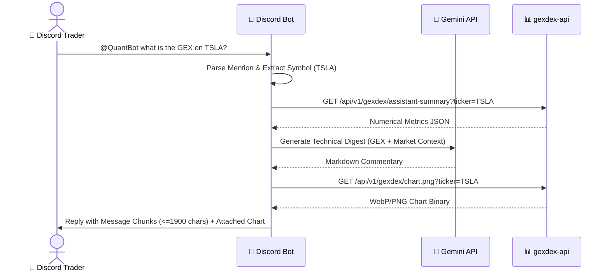

# 📱 Frontend & Client Applications Architecture

## 1. Quant AI Mobile PWA (`quant-pwa`)

### 1.1 Architecture & Design Principles
The PWA is designed specifically for **mobile traders on 5G/LTE and Home Wi-Fi**. It emphasizes zero framework bloat (<100KB bundle), instant launch times, and an OLED True Dark Theme (`#0b0e14`).

```text
quant-pwa/
├── frontend/
│   ├── index.html                   # Mobile shell (OLED dark theme, safe-area insets)
│   ├── styles.css                   # Minimalist CSS3 design system
│   ├── manifest.json                # PWA standalone manifest
│   ├── sw.js                        # Service Worker (Network-First HTML/JS, Cache-First Icons)
│   └── src/
│       ├── app.js                   # Main application bootstrap & SSE consumer
│       ├── state.js                 # Local storage (History sliding window, Passcode, Model)
│       ├── tabs/
│       │   ├── tab_manager.js       # Pluggable modular tab router
│       │   └── chat_view.js         # Streaming chat controller
│       └── components/
│           ├── diagnostics_modal.js # 5-stage latency waterfall drawer with Trace ID correlation
│           ├── settings_modal.js    # Settings configuration & diagnostics toggle switch
│           ├── quant_chart.js       # High-performance HTML5 Canvas options bar renderer
│           ├── lightbox.js          # Pinch-to-zoom full-screen chart modal
│           ├── message_renderer.js  # Markdown, LaTeX, and latency badge pill renderer
│           └── prompt_input.js      # Auto-expanding mobile prompt bar with quick chips
```

---

### 1.2 HTML5 Canvas Options Chart Engine (`quant_chart.js`)
* **Zero Dependency Canvas Engine:** Renders bi-directional horizontal bar charts (Call GEX in Emerald `#10b981`, Put GEX in Rose `#ef4444`) with zero external charting library bloat.
* **High-DPI Scaling:** Automatically adjusts canvas resolution based on `window.devicePixelRatio` for razor-sharp rendering on Retina/OLED mobile displays.
* **Interactive Geometry:** Touch and cursor crosshair inspection displays exact strike prices, call/put open interest, and net gamma values.
* **Level Lines:** Renders dashed horizontal reference lines for Spot Price (Yellow `#f59e0b`), Call Wall (Green), Put Wall (Red), and Zero Gamma Flip (Cyan `#06b6d4`).

---

### 1.3 State Management & Memory Sliding Window (`state.js`)
* **Local Storage Persistence:** Chat history, selected Gemini model (`gemini-3.7-flash`, `gemini-3.5-flash`), Bearer Session Token, and Performance Diagnostics toggle are persisted across sessions.
* **Sliding Window Context:** Retains the last 10–12 messages to feed into Gemini prompt history, pruning older interactions to maintain low token latency and prevent `localStorage` quota overflow.

---

### 1.4 Modal Lightbox & Touch Gestures (`lightbox.js`)
* **Pinch-to-Zoom & Pan Engine:** Allows traders to zoom in up to $4\times$ and pan high-resolution option charts on touch screens.
* **Double-Tap Quick Toggle:** Double-tapping toggles between $1\times$ and $2.5\times$ zoom levels.
* **Backdrop Dismissal:** Tapping anywhere outside the image or on the `✕` close button resets transforms and dismisses the overlay.
* **DOM Synchronization:** Elements strictly bind to `lightboxOverlay` and `lightboxImg` in `index.html`.

---

### 1.5 Institutional Bloomberg-Grade Diagnostics HUD (`diagnostics_modal.js`)
* **Visual Standard (Zero Emojis):** 100% purged all consumer emojis in favor of high-density monospace tabular typography (`font-variant-numeric: tabular-nums`, `JetBrains Mono`), sleek status dots (`●`), and institutional tier badges (`FAST · 3.5-LITE`, `STRATEGIC · 3.7-FLASH`, `[CACHE: HIT]`).
* **Live Response Latency Pill:** Embeds a high-density institutional badge in assistant message footers:
  `<span class="inst-tag inst-tag-fast"><span class="status-dot dot-fast"></span>FAST · 3.5-LITE</span> <span class="inst-stats">240ms · 78.4 tok/s</span> <span class="inst-cache">[CACHE: HIT]</span>`
* **5-Bar Monospace Latency Waterfall:**
  1. `01  NET     Network & SSE Handshake` (true RTT: ~20–35ms)
  2. `02  INTENT  Gemini Tool Selection (R1)` (ms)
  3. `03  DATA    Upstream Microservice (GEX/DEX)` (ms)
  4. `04  SYNTH   Gemini Synthesis TTFT (R2)` (ms)
  5. `05  RENDER  Client Canvas Paint` (ms)
* **Metadata Cards:** Displays Execution Tier, Cache Status (`HIT · 0.0ms` vs `MISS · COLD FETCH`), and Upstream Retries with live glowing status dots.
* **Settings Toggle:** Toggleable via `Show Performance Diagnostics` switch in the Settings modal.

---

### 1.6 Interactive Prompt Bar & Institutional Skill Chips (`prompt_input.js`)
* **Quick Skill Chips:** Mounts a horizontally scrollable chip bar above the prompt textarea containing pre-configured institutional commands:
  - `/gex SPY`: Real-time institutional GEX/DEX calculation and wall levels.
  - `/flow SPY`: Real-time unusual options flow with **Smart Multi-Modal Overload** (`/flow <ticker>`, `/flow <YYYY-MM-DD>`, `/flow market`).
  - `/strikes NVDA`: Multi-expiration discrete strike distribution matrix.
  - `/market`: Real-time US Equities market session status clock.
  - `/macro`: Key macroeconomic catalyst schedule (CPI, FOMC, Rate decisions).
* **Click-to-Insert Focus Mechanics:** Clicking or tapping any chip instantly populates the textarea with the template and sets focus with cursor positioning at the end of text.
* **Hover & Long-Press Tooltip Card:**
  - Desktop: Hovering over a chip renders a floating metadata card detailing parameters (multi-modal `ticker` vs `trade_date`, `lookback_days`, `min_premium`), execution mode descriptions, and practical query examples (e.g. `/flow 2026-08-21` vs `/flow NVDA`).
  - Mobile Touch: Long-press (>380ms) triggers haptic feedback (25ms vibration) and displays the tooltip card.
* **Dynamic MCP Tool Synchronization:** Automatically queries `/mcp/messages` (`tools/list`) on startup to discover and bind newly registered agent tools dynamically, falling back safely to offline defaults.

---

### 1.7 Authentic Bloomberg Terminal Options Flow Table UI (`message_renderer.js`)
* **Markdown Table AST & DOM Generation (`parseMarkdownTables`):** Intercepts streaming markdown pipe tables (`| Symbol | Order Action | ... |`) prior to line-break normalization, wrapping parsed headers (`<thead>`) and rows (`<tbody>`) inside an isolated, high-performance responsive container:
  `<div class="quant-table-wrapper" data-total-rows="..."><div class="quant-table-scroll"><table class="quant-table">...</table></div>...</div>`
* **Client-Side 20-Row Pagination (`initInteractiveTables`):**
  - **Slicing & Dynamic Rendering:** Renders 20 prints per page (`pageSize = 20`) to eliminate mobile DOM layout lag and browser freeze when presenting 100+ raw prints.
  - **Pagination Controls (`.bb-pagination`):** Renders institutional `◄ PREV` and `NEXT ►` buttons, dynamic page jump numbers (`.bb-page-num`), and print counter (`PAGE X OF Y (N PRINTS)`).
  - **Zero-Latency In-Memory Payload:** Embedded `<script type="application/json" class="tbl-payload">` serializes all parsed table records into DOM memory, enabling instant client-side page transitions with 0 server roundtrips.
* **Interactive Monospace Column Sorting (▲/▼):**
  - **Tri-State Sort Engine:** Clicking any column header cycles through `Descending (▼) -> Ascending (▲) -> Reset to Natural Order (Default)`. Natural order restores the original extracted chronological/importance sequence.
  - **Secondary Tie-Breaker (Institutional Premium Descending):** When two or more records evaluate to identical primary sort values (e.g. matching strike prices or expiration dates), the engine applies a secondary tie-breaker sorting by `Premium` descending (highest dollar volume first).
  - **Automatic Sort-Triggered Page Reset:** Initiating or cycling any column sort automatically resets active pagination back to `Page 1` to ensure top-ranked prints are immediately visible without manual scrolling.
  - **Automatic Data Type Detection (`detectColType`):** Intelligently parses column headers and cell values into `currency` (`$15.50M`, `$500K`), `percentage` (`+8.0%`, `-2.0%`), `date` (`2027-12-17`), `numeric` (OI / Volume integers), or `string`.
  - **Multi-Unit Currency Parsing (`parseSortValue`):** Accurately calculates numeric weights across billions (`B`), millions (`M`), and thousands (`K`) to ensure `$15.50M` ranks above `$500K` and `$88.00K`.
* **Automated In-Situ UI Test Suite (`test_vertical_table_ui.js`):**
  - High-fidelity mock DOM test harness executing 31 automated assertions across table rendering, 3-state sort transitions, secondary premium tie-breakers, sort class clearing, and multi-page pagination controls.
* **Horizontal Scroll Wrapper (`.quant-table-scroll`):** Employs smooth momentum scrolling (`-webkit-overflow-scrolling: touch`) with high-density compact borders (`1px solid #1e293b`), dark backdrop (`#0c1017`), and customized slim scrollbars (`height: 5px`, `#334155` thumb) to ensure frictionless multi-column table navigation on mobile OLED displays without viewport overflow.
* **Binary Action Indicator Badges:** Formats order actions into high-contrast institutional color pills:
  - **Bullish Actions (`.bb-action-bull`):** `BUY CALL`, `SELL PUT` rendered with dark emerald backdrop (`#064e3b`), vibrant text (`#34d399`), and border (`#059669`).
  - **Bearish Actions (`.bb-action-bear`):** `BUY PUT`, `SELL CALL` rendered with deep maroon backdrop (`#450a0a`), vibrant crimson text (`#f87171`), and border (`#b91c1c`).
* **Whale & Large Institutional Size Badges (`.bb-tag`):**
  - **Whale Footprints (`.bb-tag-whale`):** Trades with total premium $\ge \$5.0\text{M}$ automatically append a gold badge (`[WHALE]`, `#451a03` bg, `#fbbf24` text, `#d97706` border).
  - **Large Footprints (`.bb-tag-large`):** Trades with total premium $\ge \$1.0\text{M}$ and $<\$5.0\text{M}$ append an indigo badge (`[LARGE]`, `#312e81` bg, `#a5b4fc` text, `#4f46e5` border).
* **High-Density Tabular Monospace Typography:** Uses `font-family: var(--font-mono)`, `font-variant-numeric: tabular-nums`, bold blue ticker badges (`.bb-ticker`, `#60a5fa`), gold header accents (`.th-accent`, `#fbbf24`), and color-coded OTM distance percentages (`.bb-otm-pos` in `#34d399`, `.bb-otm-neg` in `#f87171`).

---

### 1.8 Ticker Cockpit 3-Panel Dashboard & Search View (`cockpit_view.js`)
* **Dedicated Mobile Navigation Tab:** Pluggable tab view managed by `TabManager` (`/cockpit`), providing instant single-ticker intelligence combining dealer gamma positioning with multi-week institutional options tape.
* **Persistent Search Bar & Quick Suggestion Ergonomics:**
  - Fixed mobile-optimized search header with uppercase transformation, autofocus, and zero-flicker submission.
  - Horizontally scrollable quick suggestion chips (`NVDA`, `SPY`, `TSLA`, `AAPL`, `QQQ`, `AMD`) for one-tap ticker analysis.
  - Client-side search history persistence via `localStorage.cockpit_recents` (retaining the 6 most recently analyzed tickers).
* **3-Panel Dashboard Layout:**
  - **Panel 1: Synergized Tactical Synthesis (Hero Card):**
    * **Confluence Sentiment Pill:** Color-coded institutional bias pill (`BULLISH CONFLUENCE` in emerald `#10b981`, `BEARISH CONFLUENCE` in crimson `#ef4444`, `NEUTRAL / MIXED` in amber `#f59e0b`).
    * **Microstructure Metric Pills:** Displays Live Gamma Regime, 30D Flow Call/Put Ratio (`73.7% Calls`), and Call/Put Wall Range Corridor.
    * **Live Streaming Synthesis (`/api/cockpit/synthesis/stream`):** Streams real-time AI strategic synthesis combining options gamma positioning with multi-week institutional tape flow via SSE with markdown rendering and typing animation.
  - **Panel 2: Interactive Exposure Chart & Key Levels Strip:**
    * **Zero-Dependency Canvas Engine:** High-DPI HTML5 canvas rendering Call vs. Put strike distribution.
    * **Net GEX | Net DEX Interactive Toggle:** Instant client-side switching between Gamma Exposure ($/pt) and Delta Exposure ($/share) distributions without upstream re-fetching.
    * **Key Levels HUD Strip:** Monospace indicator ribbon rendering Spot Price, Zero Gamma Flip point, Call Resistance Wall, and Put Support Wall.
  - **Panel 3: 30-Day Options Flow Table:**
    * **Interactive Bloomberg Terminal Table:** Renders 20 prints per page with responsive horizontal scroll and monospace typography.
    * **5 Instant Filter Chips:**
      1. `[All]`: Full 30-day transaction history.
      2. `[Whales >$1M]`: Filters trades with premium $\ge \$1,000,000$.
      3. `[Calls]`: Bullish/Bearish call prints (`BUY_CALL`, `SELL_CALL`).
      4. `[Puts]`: Bullish/Bearish put prints (`BUY_PUT`, `SELL_PUT`).
      5. `[Unusual OI ⚠️]`: Institutional prints exceeding prevailing open interest (`IS_UNUSUAL_OI = 1`).
    * **Tri-State Column Sorting & Secondary Tie-Breaker:** Full support for ascending/descending/natural order cycling with secondary tie-breaker sorting by premium descending.
* **Automated In-Situ UI Test Harness (`test_cockpit_view.js`):** Comprehensive mock DOM probe validating 49 automated assertions across search ergonomics, 3-panel mounting, filter chip transitions, GEX/DEX toggling, tri-state sorting, and localStorage persistence.

---

## 2. Discord Quant Bot (`discord-quant-bot`)

### 2.1 Architecture
The bot is built with Python and `discord.py`, listening for mentions on dedicated trading channels and returning formatted institutional options summaries.



### 2.2 Reliability & Security Features:
1. **Zero-Trust Channel Allowlist:** Only responds in approved Discord server channels (`ALLOWED_CHANNELS`).
2. **Message Chunking:** Splits long analyses into $\le 1900$-character batches to prevent Discord HTTP 400 crashes.
3. **Safe Error Masking:** Catches exceptions and outputs user-friendly notices without leaking internal server IPs or database connection strings.

---

## 3. Settings Modal & Database Synchronization (`SETTINGS-04` through `SETTINGS-06`)

### 3.1 Architecture & Ergonomics
The Settings Modal provides single-point management for application configuration, active session authentication, automated cache upgrades, and database synchronization:

- **Centralized Single Source of Truth (`version.json`):** Canonical version registry (`v1.0.2`) synchronized across Gateway (`APP_VERSION`), Frontend JS (`CLIENT_VERSION`), Service Worker (`CACHE_NAME`), and HTML asset queries.
- **Automated Version Bumper (`scripts/bump_version.py`):** Atomic patch bumper and parity verification utility (`--check`).
- **Dynamic Environment Badging:** Automatically identifies environment via port and hostname, rendering `v1.0.2 (Staging)` on port 8096 and `v1.0.2 (Production)` on port 8095.
- **Options Flow Freshness Indicator & In-Process Sync (`/api/flow/*`):** Checks latest trade date against expected market session and executes in-process ingestion with atomic cache invalidation.
- **Quant Levels Freshness Indicator & In-Process Sync (`/api/quant-levels/*`):** Evaluates `quant_lvl_data_te` against Eastern Time 6:30 AM cutoff and weekend Friday resolution, executing in-process web scraping and upserts on demand.
- **Full-Width Accessible Layout:** Full-width centered flexbox containers with minimum 44px WCAG tap targets on all action buttons.

