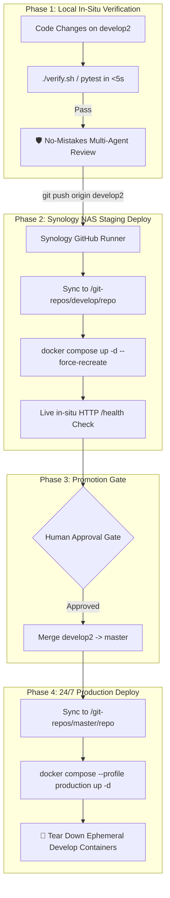

# 🚀 Infrastructure, Docker & CI/CD Lifecycle

## 1. Physical Host & Topology

* **Host Hardware:** Synology NAS (`DS920+` / `DS1821+` DSM 7.2)
* **Host IP:** `192.168.1.68`
* **Target Root Directory:** `/volume2/homes/rachardv/git-repos/`
* **Docker Network:** Shared external bridge `quant-system-network`
* **Edge Tunnel:** Cloudflare Zero-Port Outbound Daemon (`cloudflared`)

---

## 2. Port Allocations & Environment Matrix

| Environment | Branch | NAS Target Path | Service Ports | Internet / Cloudflare |
| :--- | :--- | :--- | :--- | :---: |
| **Development / Staging** | `develop2` / `develop` | `/volume2/homes/rachardv/git-repos/develop/<repo>` | • Gateway: `8001`<br>• Frontend: `8096`<br>• GexDex API: `8091` | ❌ Home Wi-Fi Only |
| **Production** | `master` / `main` | `/volume2/homes/rachardv/git-repos/master/<repo>` | • Gateway: `8000`<br>• Frontend: `8095`<br>• GexDex API: `8090` | ✅ Cloudflare 24/7 |

---

## 3. The 4-Phase CI/CD Lifecycle



---

## 4. Docker Compose & Container Architecture

### 4.1 Production Stack (`quant-pwa/docker-compose.yml`)
```yaml
services:
  gateway:
    build: ./gateway
    container_name: quant-gateway-${CONTAINER_PREFIX:-prod}
    restart: unless-stopped
    ports:
      - "${GATEWAY_PORT:-8000}:8000"
    environment:
      - APP_PASSCODE=${APP_PASSCODE}
      - GEMINI_API_KEY=${GEMINI_API_KEY}
      - GEXDEX_API_URL=${GEXDEX_API_URL:-http://gexdex-api-prod:8000}
    networks:
      - quant-system-network

  frontend:
    build: ./frontend
    container_name: quant-frontend-${CONTAINER_PREFIX:-prod}
    restart: unless-stopped
    ports:
      - "${FRONTEND_PORT:-8095}:80"
    networks:
      - quant-system-network

  cloudflared:
    image: cloudflare/cloudflared:latest
    container_name: quant-cloudflared-${CONTAINER_PREFIX:-prod}
    restart: unless-stopped
    profiles: ["production"]
    command: tunnel run --token ${CLOUDFLARE_TUNNEL_TOKEN}
    networks:
      - quant-system-network

networks:
  quant-system-network:
    external: true
```

---

## 5. Compute Optimization & Ephemeral Teardown
To keep memory usage lean on the Synology NAS, all `master` deployment runs automatically execute an ephemeral cleanup step:

```bash
DEV_DIR="/volume2/homes/rachardv/git-repos/develop/${REPO_NAME}"
if [ -d "$DEV_DIR" ]; then
  echo "🧹 Tearing down ephemeral develop containers to free NAS RAM..."
  cd "$DEV_DIR"
  docker compose down --remove-orphans || true
fi
```
This guarantees that development and testing containers only consume NAS resources during active verification.
